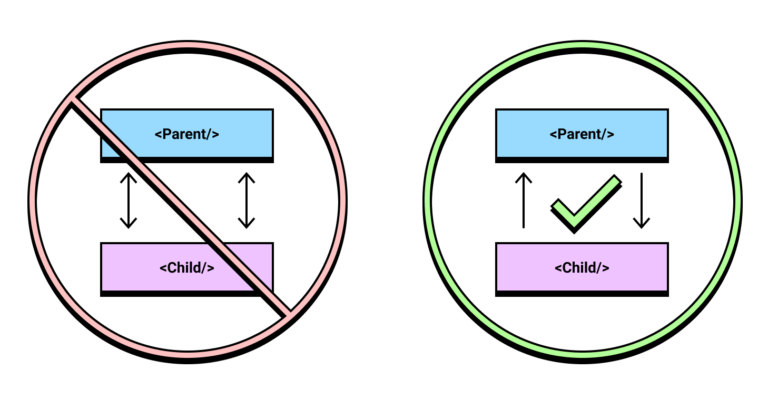

# 1. React 개요

**[수업 목표]**
- React의 개요와 특징을 이해한다. 
- React의 Component의 정의와 특징을 이해한다.
- 클래스형 Component와 함수형 Component를 구분할 수 있다.
- JSX가 무엇인지 이해하고 활용할 수 있다.
- React를 활용하여 간단한 시간 출력 화면을 구현할 수 있다.

> 👌 **리액트를 쉽게 쉽게**
> 
> - Chrome Extension
>     - `React Developer Tools`
> - VSCode
>     - `Live Server` by Ritwick Dey
>     - `Prettier` by Prettier
>     - `React Native Tools` by Microsoft
>     - `Reactjs code snippets` by charalampos karypidis

## 1. React란?

- SPA(Single Page Application) 개발을 위해 Facebook에서 개발한 프론트엔드 라이브러리
- 웹/앱 기반의 View 제작에 활발히 사용되고 있다.

## 2. React의 특징

### **1. One Way Data Flow**

React는 단방향 데이터 흐름(=단방향 바인딩)을 가진다.  
양방향 데이터 바인딩은 규모가 커질수록(대규모 애플리케이션의 경우) 데이터의 흐름을 추적하기가 힘들고 복잡해지는 경향이 있다.  
복잡한 앱에서도 데이터 흐름에서 일어나는 변화를 보다 예측 가능할 수 있도록 단방향 흐름을 가지도록 했다.  
  
출처: https://coderpad.io/blog/development/master-react-unidirectional-data-flow/


### **2. Component 기반 구조**

React는 화면상에 보이는 모든 대상을 Component 로 제작한다. Component는 `기능요소, 부품`이라는 뜻이 있다.
여러 뷰와 기능을 Component화 하면 다른 화면을 구성할 때에도 이를 **재사용할 수 있다**는 막강한 장점이 있다.
애플리케이션이 복잡해지더라도 코드의 유지보수, 관리가 용이해진다. 다음은 리액트의 컴포넌트 활용 예시이다.

```jsx
<Layout>
    <Header />
    <Navigation />
    <Content>
        <Sidebar></Sidebar>
        <Router />
    </Content>
    <Footer></Footer>
</Layout>
```

### **3. Virtual DOM 을 사용**

React는 DOM Tree를 가상화한 `Virtual DOM`을 만들고 **다시 그릴 때마다 실제 DOM과 전후 상태를 비교한다. 이때, 변경이 필요한 최소한의 변경 사항만 실제 DOM에 반영**해, 앱의 효율성과 속도를 개선하였다.

### **4. JSX 을 사용**

JSX를 사용한다. 자세한 내용은 아래의 JSX 챕터를 확인하자.

> 📔 **JSX**: Javascript를 확장한 문법. (HTML in Javascript). Typescript React의 경우 TSX를 활용한다.

## 3. React 시작하기

- **CRA** : create-react-app
    - React 생태계에서 대중적으로 사용되는 모듈들과 함께 패키징한 완성형 프로젝트
    - Webpack, Babel 라이브러리등이 들어있다.

- **필요 스펙** : nodejs (13 이상)[Node.js](https://nodejs.org/en/)
    
- **튜토리얼**
    - 리액트 커뮤니티: [https://react.dev/](https://react.dev/)
    - 한국어 튜토리얼: [https://ko.react.dev/learn](https://ko.react.dev/learn)
    
- **CRA 설치** (VSCode `terminal` 에서)
    
    ```bash
    # npx create-react-app 패키지를_설치할_경로
    npx create-react-app .
    
    # 설치 후
    create-react-app -V # 버전 확인
    
    # 실행
    npm run start
    ```
    
    → 앱이 실행되면, 브라우저로 확인

- **Vite를 사용하여 설치**
    ```base
    # 현재 폴더의 하위 폴더로 'react-app'를 생성하여 해당 위치에 프로젝트 생성
    npm create vite@latest react-app -- --template react  

    # Select a framework: React 선택

    # 'react-app' 폴더로 이동 
    cd react-app

    # 의존성 라이브러리 설치
    npm install

    # dev 모드 실행
    npm run dev
    ```

## 4. CRA 구조 살펴보기

### 1. html 파일은 1개뿐
- **index.html** : public 폴더에 있음

```html
<div id="root"></div>
```

### 2. /src 
- **대부분의 소스파일**이 들어있음

### 3. /src/index.js
- 리액트 앱의 **엔트리 스트립트(진입점)**

    ```jsx
    import React from 'react';
    import ReactDOM from 'react-dom/client';
    import './index.css'; 
    import App from './App'; // ./App.js의 App 컴포넌트를 import
    import reportWebVitals from './reportWebVitals';

    const root = ReactDOM.createRoot(document.getElementById('root'));  // 이 부분이 위의 id='root'에 해당하는 element 
    root.render(
    <React.StrictMode> {/* Strict 모드는 개발 모드에서만 활성화되기 때문에, 프로덕션 빌드에는 영향 없음. */}
        <App /> {/* App.js의 App 컴포넌트 */}
    </React.StrictMode> 
    );
    ```

- **React.StrictMode란?**
    
    [Strict 모드 - React](https://ko.reactjs.org/docs/strict-mode.html)

### 4. App.js
- /src/index.js에서 호출되어있던 `<App/>` 컴포넌트가 정의되어있는 스크립트 파일.
- 컴포넌트는 두 가지 방식으로 정의할 수 있다.

## 5. 컴포넌트 정의 방식

#### **Class형 컴포넌트**

```jsx
class App extends Component { 
    render() {
      return (
        <div className="App">
         ...
        </div>
      );
    }
}
```

> 👌 클래스형 컴포넌트는 반드시 `React.Component` 클래스를 상속받아야 하고,    
> 그를 통해 물려받은 `render()` 를 오버라이드 해야 한다.  
> `render()`의 `return`은 1개의 element만 반환할 수 있다.

#### **함수형 컴포넌트**

```jsx
function App() {
  return (
    <div className="App">
     ...
    </div>
  );
}
```

> 👌 `return`은 1개의 element만 반환할 수 있다.

## 📝 폴더 및 파일 명명 규칙

### 명명 규칙
- **폴더 및 파일:** kebab-case (예: `user-profile`, `main-header`, `auth-service`)
    - 모든 글자 소문자, 단어 사이에 하이픈(-) 사용.
    - 대소문자 혼용 문제와 운영체제에 따른 파일 충돌 예방.
- **컴포넌트 파일:** 보통 PascalCase 혹은 kebab-case
    - 예: `UserProfile.jsx` 또는 `user-profile.jsx`
    - 컴포넌트 이름은 함수/클래스 내에서는 PascalCase(예: `UserProfile`).
- **자바스크립트 함수/변수:** camelCase (예: `handleClick`, `getUserInfo`)
- **상수:** UPPER_SNAKE_CASE (예: `MAX_RETRY_COUNT`, `DEFAULT_TIMEOUT`)

### 권장 폴더 구조 예시

```
src/
│
├── assets/         # 이미지, 폰트 등 정적 파일
├── components/     # 자주 쓰이는 UI 컴포넌트
│   └── user-profile/
│       └── user-profile.jsx
├── contexts/       # React Context API 관련 파일
├── hooks/          # 커스텀 훅 파일
├── pages/          # 페이지(라우터와 매핑되는 컴포넌트)
│   └── home/
│       └── home.tsx
├── services/       # API, 서비스 레이어 (ex. `user-service.ts`)
├── styles/         # 전역/공통 스타일 파일
├── utils/          # 유틸리티 함수
└── App.tsx         # 최상위 컴포넌트
```

## 6. JSX

### **JSX란?**

- JSX(JavaScript XML)는 Javascript에 XML을 추가한 확장한 문법이다.
- JSX는 리액트로 프로젝트를 개발할 때 사용되므로 공식적인 자바스크립트 문법은 아니다.
- 브라우저에서 실행하기 전에 **바벨**을 사용하여 일반 자바스크립트 형태의 코드로 변환된다.
    - [https://babeljs.io/](https://babeljs.io/)

### **Babel**

- 자바스크립트의 문법을 확장해주는 도구.
- 아직 지원되지 않는 최신 문법이나, 편의상 사용하거나 실험적인 자바스크립트 문법들을 정식 자바스크립트 형태로 변환해준다.
- **구형 브라우저같은 환경에서도 제대로 실행** 될 수 있도록 함.

**[바벨] 컴파일 전**
```jsx
<div>Hello, React</div>;
```

**[바벨] 컴파일 후**
```jsx
React.createElement("div", null, "Hello, React");
```

### **JSX 규칙**

#### **주석**
- jsx 내의 주석은 `{/* */}`과 `//`를 사용
- js 영역에서는 js 주석 그대로 사용

```jsx
import React from "react";

function App() {

  return (
    <>
      {/* 태그 내부 주석 */}

      <a
        href="#" // 열린 태그 내부 주석
        target="_blank" // 열린 태그 내부 주석
      >some link</a>

    </> // 태그 밖 주석
  );
}

export default App;
```

#### **꼭 닫혀야 하는 태그**
- 암묵적으로 허용되었던 self-closing tag도 꼭 준수해야 한다.
    - `<br>` (X)
    - `<br/>` (O)

```jsx
import React from "react";

function App() {
  return (
    <div className="App">
      Hello,<br> {/* <-- 에러 */}
      React
    </div>
  );
}

export default App;
```

#### **1개의 root element로 구성되어야 한다.**

```jsx
// 잘못된 예
import React from "react";

function App() {
  return (
    <div></div>
    <div></div>
  );
}

export default App;
```

```jsx
// 올바른 예 - <div>로 감싸기 (단점. div가 많아짐)
import React from "react";

function App() {
  return (
    <div>
      <div></div>
      <div></div>
    </div>
  );
}

export default App;
```

```jsx
// 올바른 예2 - React Fragment 사용 (이름 없는 태그 ~> 브라우저 html에 포함되지 않음. 단, display는 block이 아닌 inline)
import React from "react";

function App() {
  return (
    <>
      <div></div>
      <div></div>
    </>
  );
}

export default App;
```

#### ** JSX 영역 내에서 자바스크립트 값은 `{}`로 표기**
- 자바스크립트 측의 값(`변수`, `함수의 리턴값`, `인스턴스의 프로퍼티` 등)은 `{}`를 사용하여 jsx 에 포함해야 한다.

```jsx
import React from "react";

function App() {

  let x = 10;
  let y = 20;

  return (
    <>
      <div>{x} + {y} = {x + y}</div>
    </>
  );
}

export default App;
```

#### **class 속성은 className으로**

```jsx
import React from "react";

function App() {

  return (
    <>
      <div className="content">Hello, World</div>
      {/* <div class="content">Hello, World</div> */}
    </>
  );
}

export default App;
```

#### **style 관련**
- css property는 `camelCase`로 표기
- inline style은 객체(`{}`) 타입으로 지정. 

```jsx
import React from "react";

function App() {

  const contentStyle = {
    backgroundColor: 'salmon',
    color: 'white',
    fontSize: 24,   // 기본 단위 px,
    padding: '1rem' // 다른 단위 표기시 str로 표기
  }

  return (
    <div>
      <p style={contentStyle}>
        Hello, React!
      </p>
    </div>
  );
}

export default App;
```

### 예제

```jsx
function HelloReact() {
    const contentStyle = {
        backgroundColor: 'salmon',
        color: 'white',
        fontSize: 24, 
        padding: '1rem'
    }

    let name = 'John Doe';
    
    return (
        <div style={contentStyle}>
            <h1>Hello, React!</h1>
            <p>Welcome, {name}!</p>
        </div>
    );
}

export default HelloReact;
```

### **JSX 실습**

- 시간을 출력하는 컴포넌트 만들기
- 새로고침 시 현재 시간이 화면에 나타나도록 하기
- 힌트: `new Date().toLocaleTimeString()` 활용!

### **JSX 실습 답안**

#### **1. Clock.jsx**

```jsx
const Clock = () => {
    return (
        <div>
            <h1>현재 시간: {new Date().toLocaleTimeString()}</h1>
        </div>
    );
};

export default Clock;
```

